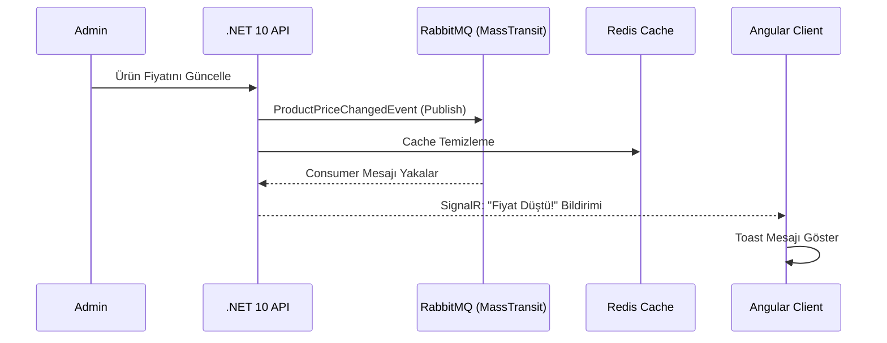

<div align="center">

# 🛒 ETicaretProjesi V2.0

### Real-Time · Clean Architecture · Ultra-Minimalist


</div>

---

Modern web teknolojileri üzerine inşa edilmiş, **Clean Architecture** prensiplerini benimseyen; gerçek zamanlı bildirim, anlık mesajlaşma ve asenkron iş süreçlerini bir arada barındıran tam kapsamlı bir e-ticaret platformu.

Arayüz, **Ultra-Minimalist Monochrome** tasarım anlayışıyla kurgulanmış — sade, keskin, dikkat dağıtmayan.

---

## 📐 Mimari

**Clean Architecture (Onion Architecture)** üzerine kurulu beş katmanlı yapı:

| Katman | Sorumluluk |
|--------|-----------|
| `API` | RESTful endpoint'ler, SignalR Hub'ları, Middleware pipeline |
| `Application` | İş mantığı, DTO mapping (AutoMapper), Event Consumer'lar |
| `Infrastructure` | Dış servis entegrasyonları — Iyzico, Redis, SignalR |
| `Persistence` | EF Core konfigürasyonları, Repository implementasyonları, Seed verileri |
| `Domain` | Çekirdek entity'ler ve iş kuralları |

---

## ✨ Öne Çıkan Özellikler

**🔔 Gerçek Zamanlı Bildirimler**
Admin bir ürünün fiyatını güncellediğinde `ProductPriceChangedEvent` RabbitMQ üzerinden yayınlanır; MassTransit consumer bu mesajı yakalar ve ürünü favorileyen tüm kullanıcılara **SignalR** üzerinden anlık bildirim iletir.

**💳 Ödeme & Güvenlik**
Iyzico entegrasyonu ile güvenli ödeme altyapısı; JWT + ASP.NET Identity ile token tabanlı oturum yönetimi; Redis tabanlı **RedLock** ile race condition'lara karşı dağıtık kilit mekanizması.

**💬 İletişim**
- `ChatHub` — Alıcı-satıcı arası anlık mesajlaşma
- `SupportHub` — Canlı müşteri destek sistemi
- `TrafficHub` — Online kullanıcı sayısı ve site trafiğinin gerçek zamanlı takibi

**🎨 Modern Arayüz**
Gözü yormayan monochrome UI; Standalone component mimarisi; RxJS tabanlı reaktif veri yönetimi; `ngx-translate` ile tam i18n desteği.

---

## 🛠️ Teknoloji Yığını

**Backend**
- .NET 10 / C# 14 · PostgreSQL + Entity Framework Core
- Redis (Cache & Distributed Lock) · RabbitMQ + MassTransit
- Scalar API Docs (Mars Theme) · Serilog

**Frontend**
- Angular 21 · RxJS · Bootstrap Icons · Swiper.js · Chart.js · @ngx-translate

---

## 🔄 Sistem Akış Diyagramı



---

## 🚀 Kurulum

**Ön koşullar:** .NET 10 SDK · Node.js v20+ · Docker

**1 — Servisleri başlat**
```bash
docker run -d --name eticaret-redis -p 6379:6379 redis
docker run -d --name eticaret-rabbit -p 5672:5672 -p 15672:15672 rabbitmq:3-management
```

**2 — Backend**
```bash
cd ETicaretProjesiV2.0/ETicaretProjesiV2.0.API
dotnet ef database update
dotnet run
```
> API: `https://localhost:7185` · Scalar Docs: `https://localhost:7185/scalar/v1`

**3 — Frontend**
```bash
cd Eticaret-client
npm install
npm start
```
> Client: `http://localhost:4200`

---

## 📄 Lisans

Bu proje eğitim ve portfolyo amaçlı geliştirilmiştir. Katkıda bulunmak için bir `Issue` açın veya `Pull Request` gönderin.
