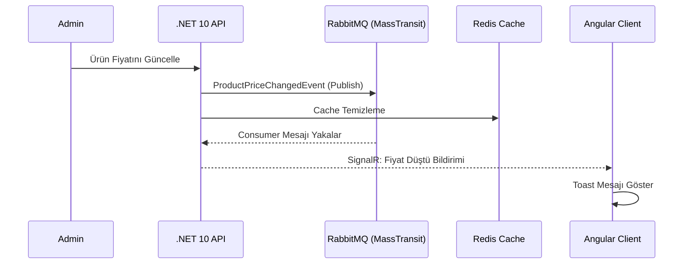

<div align="center">

# ETicaretProjesi V2.0

### Real-Time E-Commerce Platform with Clean Architecture


</div>

---

Modern web teknolojileri üzerine inşa edilmiş, **Clean Architecture** prensiplerini benimseyen; gerçek zamanlı bildirim, anlık mesajlaşma ve asenkron iş süreçlerini bir arada barındıran tam kapsamlı bir e-ticaret platformudur. Arayüz, **Ultra-Minimalist Monochrome** tasarım anlayışıyla kurgulanmıştır.

---

## Mimari Yapı

Proje, **Clean Architecture (Onion Architecture)** prensipleri doğrultusunda beş bağımsız katmana ayrılmıştır. Her katman yalnızca kendisinin içinde ya da daha iç katmanlarda tanımlı bağımlılıklara erişebilir; bu kural derleme zamanında zorlanmaktadır.

### Domain

Uygulamanın çekirdeğini oluşturur. Dış dünyadan tamamen bağımsızdır; herhangi bir framework ya da kütüphaneye referans içermez. `BaseEntity` soyut sınıfı tüm entity'ler tarafından miras alınır ve `Id (Guid)`, `CreatedDate`, `UpdatedDate`, `IsDeleted`, `DeletedDate` alanlarını standartlaştırır. `AppUser` ve `AppRole`, ASP.NET Identity'den türetilmiş ancak domain kurallarına göre genişletilmiş kimlik varlıklarıdır.

### Application

İş mantığının yaşadığı katmandır. Service sınıfları, DTO'lar, AutoMapper profilleri ve MassTransit Consumer'ları bu katmanda tanımlanır. Consumer'lar domain event'lerini dinler ve ilgili iş akışlarını tetikler: `OrderCreatedConsumer` PDF fatura üretir ve e-posta gönderir; `ProductPriceChangedConsumer` fiyat düşüşünü favorileyen kullanıcılara SignalR bildirimi olarak iletir; `GenerateReportEventConsumer` yönetici tarafından tetiklenen satış raporlarını Excel formatında üretir ve diske kaydeder.

### Infrastructure

Dış servis entegrasyonlarını kapsar; ödeme, önbellekleme ve gerçek zamanlı iletişim gibi teknik detaylar bu katmanda soyutlanır. **Iyzico** entegrasyonu ödeme ve bakiye yönetimini; **Redis** dağıtık önbellekleme ve `RedLockNet` aracılığıyla dağıtık kilit mekanizmasını; **SignalR** ise dört bağımsız Hub bileşeni üzerinden gerçek zamanlı iletişimi sağlar. Ayrıca Serilog tabanlı yapılandırılmış günlükleme altyapısı ve `GlobalExceptionMiddleware`, `RequestResponseLoggingMiddleware`, `PerformanceMiddleware` gibi özel middleware bileşenleri burada tanımlıdır.

### Persistence

Veritabanı katmanıdır. PostgreSQL, Entity Framework Core ile **Code-First** yaklaşımıyla entegre edilmiştir. `IGenericRepository<T>` arayüzü ve implementasyonu tüm CRUD operasyonlarını standartlaştırır. Fluent API aracılığıyla entity ilişkileri konfigüre edilmiş; `SaveChangesAsync` override edilerek fiziksel silme yerine **Soft Delete** stratejisi hayata geçirilmiştir. Global sorgu filtreleri (`HasQueryFilter`) silinmiş kayıtları tüm sorgulardan otomatik olarak dışarıda bırakır.

### API

Sunum katmanıdır. On beşi aşkın RESTful controller, dört SignalR Hub ve özel middleware pipeline bu katmanda yer alır. `DetectionMiddleware`, her gelen istekte kullanıcının IP adresi ve User-Agent bilgisini Redis'teki önceki kayıtla karşılaştırarak oturum güvenliğini izler. Sipariş oluşturma akışında `RedLock` dağıtık kilit mekanizması devreye girerek aynı anda birden fazla isteğin stok tutarsızlığına yol açmasını engeller.

---

## Veritabanı Tasarımı

On beş temel entity tasarlanmış ve Fluent API ile ilişkileri konfigüre edilmiştir: `Product`, `Category`, `Order`, `OrderItem`, `Basket`, `BasketItem`, `Offer`, `WalletTransaction`, `ProductComment`, `ProductQuestion`, `SupportTicket`, `TicketMessage`, `DirectMessage`, `UserFavorite`, `PaymentTransaction`. Kategori hiyerarşisi self-referencing ilişkiyle kurgulanmış; her kategorinin alt kategorileri olabilir. Tüm entity'lerde yumuşak silme (Soft Delete) uygulanmaktadır.

---

## Asenkron İş Süreçleri

**RabbitMQ** mesaj kuyruğu, **MassTransit** kütüphanesi aracılığıyla sisteme entegre edilmiştir. Sipariş oluşturma, fiyat değişikliği bildirimi ve rapor üretimi gibi uzun süren işlemler ana API akışını bloklamak yerine kuyruk üzerinden asenkron olarak işlenir. Her Consumer bağımsız bir background servis olarak çalışır ve mesajları güvenilir biçimde tüketir.

---

## Gerçek Zamanlı İletişim

SignalR dört ayrı Hub bileşeniyle uygulanmıştır. `ChatHub`, alıcı ve satıcı arasındaki anlık mesajlaşmayı yönetir. `SupportHub`, müşteri ve destek ekibi arasındaki canlı destek görüşmelerini sağlar. `NotificationHub`, kullanıcılara fiyat değişikliği ve sipariş durum güncellemelerini iletir. `TrafficHub`, online kullanıcı sayısını ve site trafiğini gerçek zamanlı olarak yönetici paneline yansıtır. Yatay ölçekleme senaryolarında Hub bileşenleri arasında mesaj senkronizasyonu **Redis backplane** ile sağlanmaktadır.

---

## Güvenlik

Kimlik doğrulama **JWT (JSON Web Token)** standardıyla sağlanmış; `TokenService` erişim ve yenileme token'larını üretir. ASP.NET Identity, kullanıcı ve rol yönetimini üstlenir. Şifre sıfırlama ve e-posta doğrulama işlemleri, 15 dakika geçerli OTP tabanlı bir mekanizmayla gerçekleştirilir. `DetectionMiddleware`, kullanıcının IP adresi veya User-Agent bilgisinde anormal bir değişim tespit ettiğinde oturumu sonlandırır.

---

## Frontend Mimarisi

Angular 21, **Standalone Component** mimarisiyle kullanılmıştır. Uygulama sekiz modüle ayrılmıştır: `admin`, `auth`, `product`, `order`, `basket`, `category`, `direct-message`, `notification`. HTTP istekleri, `AuthInterceptor` aracılığıyla JWT token'larını otomatik olarak ekler. Korumalı sayfalara erişim `AuthGuard` ve `AdminGuard` route koruyucularıyla güvence altına alınmıştır. Tasarım, üçüncü taraf CSS kütüphanelerine bağımlılık oluşturulmaksızın saf **SCSS** ile bileşen bazında gerçekleştirilmiştir.

---

## Sistem Akış Diyagramı



---

## Teknoloji Yığını

**Backend**
- .NET 10 / C# 14, ASP.NET Core Web API
- PostgreSQL, Entity Framework Core (Code-First)
- Redis — Distributed Cache & RedLock
- RabbitMQ & MassTransit
- SignalR
- Serilog, Scalar API Docs, QuestPDF, MailKit

**Frontend**
- Angular 21, RxJS, TypeScript
- Bootstrap Icons, Swiper.js, Chart.js
- @ngx-translate

---

## Kurulum

**Ön koşullar:** .NET 10 SDK, Node.js v20+, Docker

**1 — Servisleri başlat**
```bash
docker run -d --name eticaret-redis -p 6379:6379 redis
docker run -d --name eticaret-rabbit -p 5672:5672 -p 15672:15672 rabbitmq:3-management
```

**2 — Backend**
```bash
cd ETicaretProjesiV2.0/ETicaretProjesiV2.0.API
dotnet ef database update
dotnet run
```

> API: `https://localhost:7185` · Scalar Docs: `https://localhost:7185/scalar/v1`

**3 — Frontend**
```bash
cd Eticaret-client
npm install
npm start
```

> Client: `http://localhost:4200`

---

## Lisans

Bu proje eğitim ve portfolyo amaçlı geliştirilmiştir. Katkıda bulunmak için bir `Issue` açın veya `Pull Request` gönderin.
