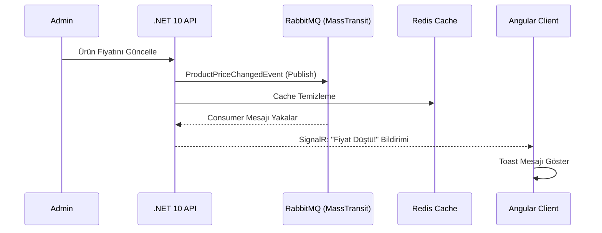

# ETicaretProjesi V2.0 - Real-Time Ultra-Minimalist E-Commerce Platform


Modern web teknolojileri kullanılarak geliştirilmiş, **Clean Architecture** prensiplerini temel alan, gerçek zamanlı (real-time) bildirim, mesajlaşma ve asenkron iş süreçlerini barındıran üst düzey bir e-ticaret platformudur. 

Proje, kullanıcı deneyimini **Ultra-Minimalist Monochrome** tasarım anlayışıyla birleştirerek hem estetik hem de yüksek performanslı bir çözüm sunar.

---

## Mimari Yapı

Proje, sürdürülebilirlik ve test edilebilirlik için **Clean Architecture (Onion Architecture)** üzerine inşa edilmiştir:

*   **API:** RESTful endpoint'ler, SignalR Hub'ları ve Middleware'ler.
*   **Application:** İş mantığı (Service layer), DTO mapping (AutoMapper), CQRS benzeri yapı ve Event Consumer'lar.
*   **Infrastructure:** Dış servis entegrasyonları (Iyzico, SignalR Service, Redis Cache).
*   **Persistence:** EF Core konfigürasyonları, Repository implementasyonları ve Database Seed verileri.
*   **Domain (Entities):** Çekirdek modeller ve iş kuralları.

---

## Öne Çıkan Özellikler

### Gerçek Zamanlı Bildirim Sistemi (SignalR + RabbitMQ)
*   **Fiyat Alarmları:** Admin panelinden bir ürünün fiyatı değiştiğinde, `MassTransit` üzerinden `ProductPriceChangedEvent` yayınlanır. Background consumer'lar bu mesajı yakalar ve ürünü favorileyen kullanıcılara `SignalR` üzerinden anlık bildirim gönderir.
*   **Stok Uyarıları:** Kritik stok seviyelerine ulaşıldığında otomatik sistem bildirimleri.

### Ödeme ve Güvenlik
*   **Iyzico Entegrasyonu:** Güvenli ödeme altyapısı ve işlem takibi.
*   **JWT Authentication:** ASP.NET Core Identity ile güçlendirilmiş, güvenli token tabanlı oturum yönetimi.
*   **Distributed Locking:** Redis tabanlı `RedLockNet` ile yarış durumlarını (race conditions) önleyen güvenli işlem yönetimi.

### İletişim ve Trafik
*   **Direct Message (DM):** Alıcı ve satıcılar arasında `ChatHub` ile anlık mesajlaşma.
*   **Destek Sistemi:** `SupportHub` üzerinden canlı müşteri desteği.
*   **Canlı Trafik İzleme:** `TrafficHub` ile online kullanıcı sayısı ve site trafiğinin anlık takibi.

### Modern Arayüz
*   **Monochrome UI:** Gözü yormayan, premium hissettiren siyah-beyaz minimalist tasarım.
*   **İleri Seviye Angular:** Standalone component mimarisi, RxJS tabanlı reaktif veri yönetimi ve `ngx-translate` ile tam i18n desteği.

---

## Teknoloji Yığını

### Backend
- **Framework:** .NET 10 (C# 14)
- **Veritabanı:** PostgreSQL (Entity Framework Core)
- **Önbellekleme:** Redis (Distributed Cache & Distributed Lock)
- **Mesajlaşma:** RabbitMQ & MassTransit
- **API Dokümantasyonu:** Scalar (Mars Theme)
- **Logging:** Serilog (File-based)

### Frontend
- **Framework:** Angular 21 (Latest/Experimental)
- **State Management:** RxJS (Observables & Subjects)
- **UI Libraries:** Bootstrap Icons, Swiper.js, Chart.js
- **Localization:** @ngx-translate

---

## Sistem Akış Diyagramı



---

## Kurulum Adımları

### Ön Koşullar
*   .NET 10 SDK
*   Node.js (v20+)
*   Docker (RabbitMQ ve Redis için)

### 1. Servisleri Başlatın (Docker)
```bash
docker run -d --name eticaret-redis -p 6379:6379 redis
docker run -d --name eticaret-rabbit -p 5672:5672 -p 15672:15672 rabbitmq:3-management
```

### 2. Backend Kurulumu
```bash
cd ETicaretProjesiV2.0/ETicaretProjesiV2.0.API
dotnet ef database update
dotnet run
```
*API: `https://localhost:7185` | Scalar API Docs: `https://localhost:7185/scalar/v1`*

### 3. Frontend Kurulumu
```bash
cd Eticaret-client
npm install
npm start
```
*Client: `http://localhost:4200`*

---

## Lisans ve Katkıda Bulunma
Bu proje eğitim ve portfolyo amaçlı geliştirilmiştir. Katkıda bulunmak için lütfen bir `Issue` açın veya `Pull Request` gönderin.

